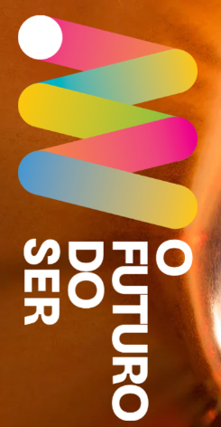

<!-- PROJECT LOGO -->
 

  

<h3 align="center">Exposição O Futuro do Ser</h3>

  

    The "Exposição O Futuro do Ser" project is a Single Page Application (SPA) developed to provide a seamless and efficient user experience. With a responsive and modern design, this application allows users to perform informative awareness queries.
     
    <a href="#"><strong>Explore the docs »</strong></a>
     
     
    <a href="https://pilulasdesaude.com.br/especiais/o-futuro-do-ser/" target="_blank" rel="nofollow">View Demo</a>
    ·
  

<!-- ABOUT THE PROJECT -->
## About The Project

[![Product Name Screen Shot][product-screenshot]](https://pilulasdesaude.com.br/especiais/o-futuro-do-ser/)

(<a href="#readme-top">back to top</a>)

### Built With

* [![Next][Next.js]][Next-url]
* [![React][React.js]][React-url]
* [![Bootstrap][Bootstrap.com]][Bootstrap-url]

(<a href="#readme-top">back to top</a>)

<!-- LICENSE -->
## License

Distributed under the MIT License. See `LICENSE.txt` for more information.

(<a href="#readme-top">back to top</a>)

<!-- CONTACT -->
## Contact

Eduardo Moraes   [![LinkedIn][linkedin-shield]][linkedin-url]   adomoraes@gmail.com

Project Link: [https://github.com/adomoraes/o-futuro-do-ser](https://github.com/adomoraes/o-futuro-do-ser)

(<a href="#readme-top">back to top</a>)

<!-- MARKDOWN LINKS & IMAGES -->
<!-- https://www.markdownguide.org/basic-syntax/#reference-style-links -->
[contributors-shield]: https://img.shields.io/github/contributors/github_username/repo_name.svg?style=for-the-badge
[contributors-url]: https://github.com/adomoraes/o-futuro-do-ser/graphs/contributors
[forks-shield]: https://img.shields.io/github/forks/github_username/repo_name.svg?style=for-the-badge
[forks-url]: https://github.com/adomoraes/o-futuro-do-ser/network/members
[stars-shield]: https://img.shields.io/github/stars/github_username/repo_name.svg?style=for-the-badge
[stars-url]: https://github.com/adomoraes/o-futuro-do-ser/stargazers
[issues-shield]: https://img.shields.io/github/issues/github_username/repo_name.svg?style=for-the-badge
[issues-url]: https://github.com/adomoraes/o-futuro-do-ser/issues
[license-shield]: https://img.shields.io/github/license/github_username/repo_name.svg?style=for-the-badge
[license-url]: https://github.com/adomoraes/o-futuro-do-ser/blob/master/LICENSE.txt
[linkedin-shield]: https://img.shields.io/badge/-LinkedIn-black.svg?style=for-the-badge&logo=linkedin&colorB=555
[linkedin-url]: https://www.linkedin.com/in/eduardo-moraes-939312143/
[product-screenshot]: images/screenshot.png
[Next.js]: https://img.shields.io/badge/next.js-000000?style=for-the-badge&logo=nextdotjs&logoColor=white
[Next-url]: https://nextjs.org/
[React.js]: https://img.shields.io/badge/React-20232A?style=for-the-badge&logo=react&logoColor=61DAFB
[React-url]: https://reactjs.org/
[Bootstrap.com]: https://img.shields.io/badge/Bootstrap-563D7C?style=for-the-badge&logo=bootstrap&logoColor=white
[Bootstrap-url]: https://getbootstrap.com
[JQuery.com]: https://img.shields.io/badge/jQuery-0769AD?style=for-the-badge&logo=jquery&logoColor=white
[JQuery-url]: https://jquery.com 